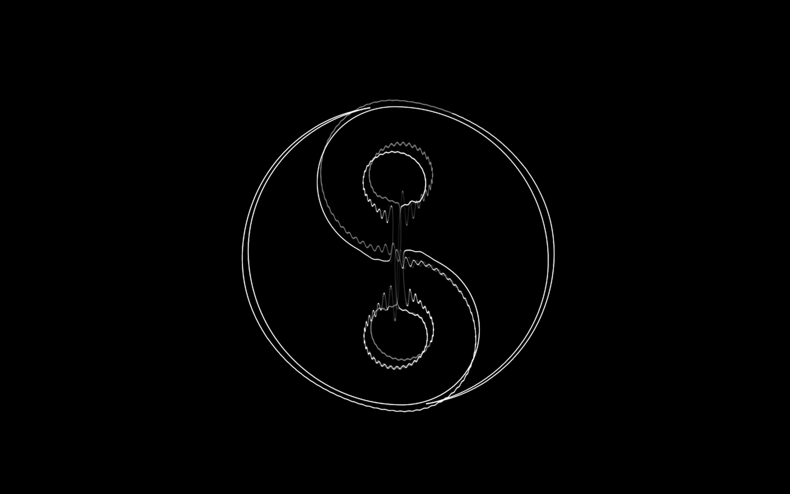

# trace for workshop computer

trace is a collection of oscillograph oscillators with two channel outputs, designed to work with X/Y mode on oscilloscope to make oscillograph.

Made for [Musicthing Modular Workshop Computer](https://github.com/TomWhitwell)

Use with all kinds of effects and make cool oscilloscope music with cohesive visuals.

## Overview

There are currently three banks of oscillator built with different models.

- Bank A - math defiend oscillator (the Yin/Yang symbol above is an example)
- Bank B - 3d polygon oscillator, project 3d polygon to 2d plane
- Bank C - wavetable oscillator, use two single cycle waveform to trace vector graphic

## Controls and I/O

| Control | Function |
|---------|----------|
| `Main Knob` | Pitch (exponential), summed with `CV In 1` |
| `X Knob`   | Growth, depth of phase, summed with `Audio In 1`<br> **ALT:** attenuate `Audio In 1` when switch is `up` |
| `Y Knob`   | Depends on selected oscillator, summed with `Audio In 2`<br> **ALT:** attenuate `Audio In 2` when switch is `up` |
| `Toggle witch` | **UP**: Enable **ALT**<br>**MID**: Normal mode.<br>**DOWN**: Move to next oscillator|
| `LED` | Left collum indicate oscillator bank, right collum indicate index (top to bottom)|

| Jack I/O | Function |
|----------------|----------|
| `Audio In 1`    | Modulate ***Growth***|
| `Audio In 2`    | Modulate ***Y Knob***|
| `Audio Out 1`| Audio out horizontal channel - L|
| `Audio Out 2`| Audio out vertical channel - R |
| `CV In 1`    | Adds to the ***Pitch***<br>(not calibrated to 1V/OCT **help on this maybe?) |
| `Pulse In 1`| Rising edge cycles through osc within the same bank|
| `Pulse In 2`| |
| `Pulse Out 1`| Fires when switch `down` toggled |

## Usage

### Build

Project built with earlephilhower core and [Chris Johnson's ComputerCard library](https://github.com/TomWhitwell/Workshop_Computer/tree/main/Demonstrations%2BHelloWorlds/PicoSDK/ComputerCard) with no additional library dependency. Should also be compatible with PicoSDK.

If you are not using platformio, grab the headers and code from `/include` and `/src` and build with PicoSDK toolchain or ArduinoIDE.

### Add Custom Shape
Oscillators are defined in `oscillator.h`, create new oscillator class derived from `class Oscillator`. There are currently three banks of oscillator with different approaches to create waveform, but it is trully limitless, you can make your own implementation and do whatever you can imagine.

For **Bank 1**, math defined waveform, combine functions driven by phase to create uniq shapes.

If you are familiar with Max/MSP and Gen, have a look at these [amazing example patches](https://oscilloscopemusic.com/software/maxforlive/). The philosophy and math are transferable to C++

For **Bank 2** and **Bank 3**, polygon and wavetable, the waveform comes from sample stored in `mesh_data.h` and `lookup_tables.h`

There are two python script respectively to convert `*.obj` mesh or `*.wav` wavetable to supported data format to store in the header.

```console
python util/mesh_prep.py data/<your-model>.obj -o data/<your-model>.h
```

** Make sure there is only one mesh obejct in the `.obj` and keep mesh as simple as possible. Scale the mesh to fit inside a unit cube to preserve the correct scale.

```console
python util/wavtable_prep.py <your-wt>.wav -o [your-wt].h
```

** The wavetable needs to be stereo for both channel X/Y. The wave will be resampled, keep the wave single cycle.<br>
** To draw any arbitrary shape, path in `.svg` could be sampled into wavetable on two axes.

After conversion, copy the data into repective headers and  create a new instance of `Oscillator` to use the data.

## Future Plan
- Calibrate pitch input to 1v/OCT
- Add more oscillator variation
- Web interface to upload new shape from mesh/wavetable
- Use binary code for LED for maximum 8 banks of 8 oscillators

## Credit
Big thanks to @Jerobeam Fenderson for inspiration, find amazing oscilloscope art on his website [oscilloscope music](https://oscilloscopemusic.com)

Use an analog oscilloscope for the best visual or download this cross platform [oscilloscope](https://oscilloscopemusic.com/software/oscilloscope/) with your interface.